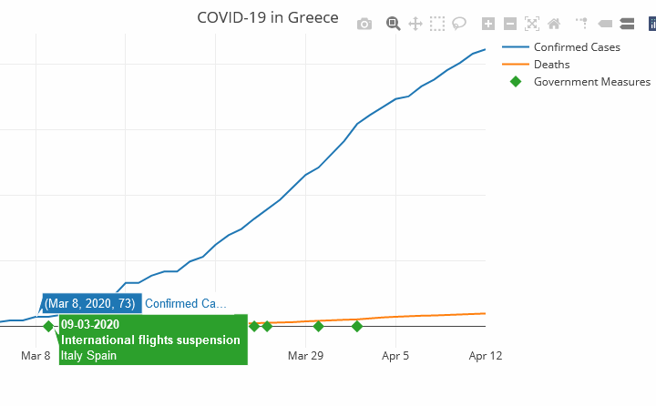

# COVID-19 Pandemic Dashboard
An interactive dashboard for the COVID-19 pandemic, developed with the Dash framework. Users can choose the country of their preference to view a graph of the confirmed COVID-19 cases, deaths, and/or recovered patients. They can also hover or tap on the diamond symbols, to read about the government measures that have been implemented in each country. The dashboard has been deployed on Heroku, and is available [here](https://pandemic-dashboard.herokuapp.com/).

